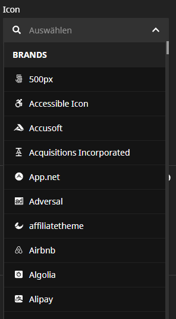

# Neos CMS FontAwesome Pugin

[](https://packagist.org/packages/vivomedia/neos-jpeg-pagespeed-optimization)
[](https://packagist.org/packages/vivomedia/neos-jpeg-pagespeed-optimization)
[](https://packagist.org/packages/vivomedia/neos-jpeg-pagespeed-optimization)
[](https://codeclimate.com/github/VIVOMEDIA/neos-fontawesome-icon/maintainability)

FontAwesome Metadata Version: **5.15.1**

Supported FontAwesome Version by Neos: **5.12.1**

Plugin to add FontAwesome icon selector to your nodetypes. It also provides a default FontAwesome icon nodetype.

The plugin determines based on the selected version, the supported icons. 

## Install

Install with composer

```
composer require vivomedia/neos-fontawesome-icon 
```

## Configuration

You can set up your desired FontAwesome Version in `/Configuration/Development/Settings.yaml`

```
VIVOMEDIA:
  FontAwesome:
    Icon:
      licence: free #pro
      version: 5.12.1
``` 

## Screenshots


## Known Issues
The Neos backend UI is using its own FontAwesome (free) version. If you want to use a newer or the pro version with your website you will not see a preview for newer or pro icons in the editor.  